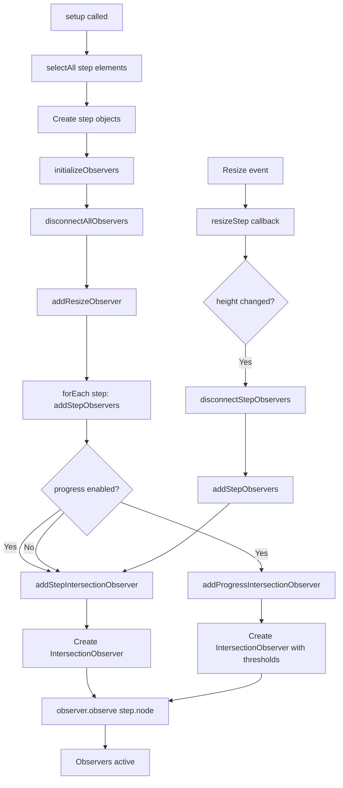
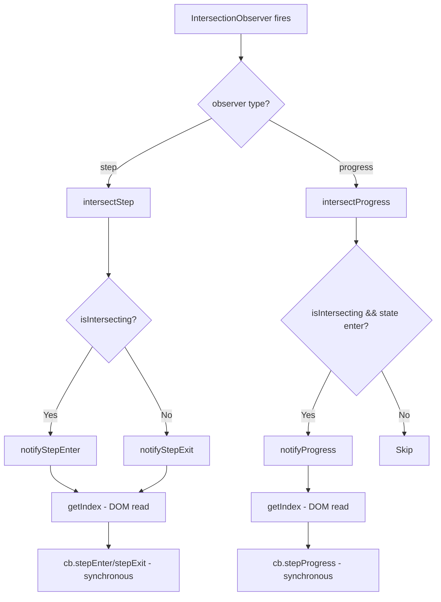
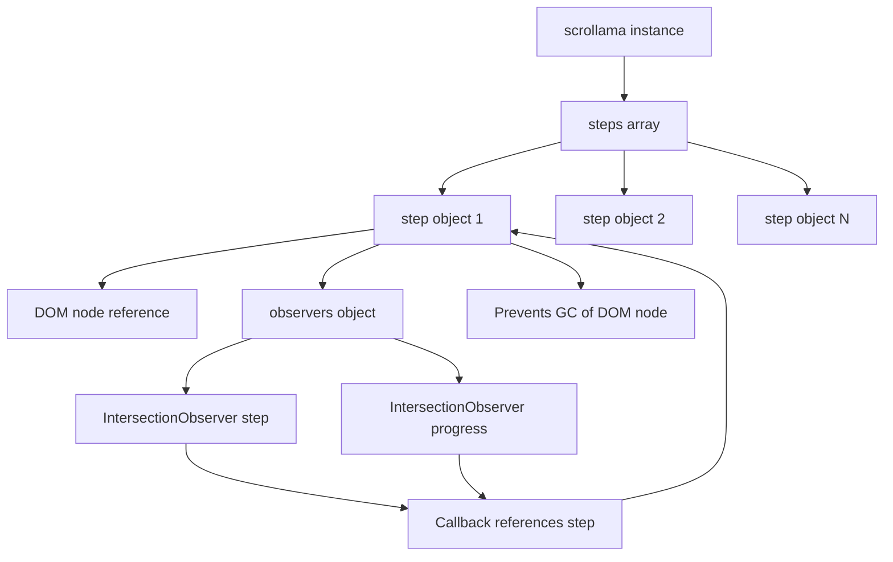

# Performance Analysis Report: Scrollama Library

**Version Analyzed:** 3.2.0  
**Date:** 2024  
**Library Size:** 11KB (unminified), 4.7KB (minified)

## Executive Summary

This performance analysis identifies several critical and moderate performance bottlenecks in the scrollama library. The library uses modern web APIs (IntersectionObserver, ResizeObserver) effectively, but there are opportunities for optimization in observer management, DOM operations, and callback execution patterns.

### Critical Issues

1. **Observer Proliferation**: 2x IntersectionObserver instances per step when progress tracking is enabled
2. **Full Observer Recreation**: All observers are disconnected and recreated on resize events
3. **Frequent DOM Attribute Reads**: `getAttribute` called in hot callback paths
4. **No Callback Debouncing**: Progress callbacks can fire at very high frequencies

### Quick Wins

- Cache index lookups instead of reading DOM attributes
- Debounce/throttle progress callbacks
- Optimize observer recreation to only update changed steps
- Use WeakMap for step-to-index mapping

### Long-term Optimizations

- Implement observer pooling/reuse
- Lazy initialization of observers
- RequestAnimationFrame for callback batching
- Virtual scrolling support for large step counts

---

## 1. IntersectionObserver Performance

### Current Implementation

The library creates **1-2 IntersectionObserver instances per step element**:

- **Step Observer**: Always created (lines 138-156 in `src/entry.js`)
- **Progress Observer**: Created only when `progress: true` (lines 158-173 in `src/entry.js`)

**Code Reference:**

```javascript
// src/entry.js:133-136
function addStepObservers(step, isProgress) {
	addStepIntersectionObserver(step);
	if (isProgress) addProgressIntersectionObserver(step);
}
```

### Bottlenecks Identified

#### 1.1 Observer Count Multiplication

**Impact: HIGH**  
**Location:** `src/entry.js:133-136, 158-173`

**Problem:**

- With 100 steps and `progress: true`, the library creates **200 IntersectionObserver instances**
- Each observer has its own callback, options calculation, and memory overhead
- Browser must track and evaluate all observers during scroll

**Performance Impact:**

- Memory: ~2-5KB per observer instance (browser-dependent)
- CPU: Each observer callback fires independently, causing multiple function calls per scroll frame
- Scalability: O(2n) observer count where n = number of steps

**Example Scenario:**

```javascript
// 50 steps with progress enabled = 100 observers
scroller.setup({
	step: '.step', // 50 elements
	progress: true, // Creates 2 observers per step
});
// Total: 100 IntersectionObserver instances
```

#### 1.2 Observer Recreation on Resize

**Impact: HIGH**  
**Location:** `src/entry.js:175-179, 89-100`

**Problem:**
When any step element resizes, the ResizeObserver callback triggers a full disconnect and recreation cycle:

```javascript
// src/entry.js:89-100
function resizeStep(entries) {
	entries.forEach((entry) => {
		const index = getIndex(entry.target);
		const step = steps[index];
		const h = entry.target.offsetHeight;
		if (h !== step.height) {
			step.height = h;
			disconnectStepObservers(step); // Disconnect
			addStepObservers(step, isProgress); // Recreate
		}
	});
}
```

**Performance Impact:**

- **Disconnect overhead**: `disconnect()` must remove callbacks and cleanup internal state
- **Recreation overhead**: New observer creation involves:
  - Root margin calculation (lines 139-145, 159-165)
  - Threshold array generation for progress (line 167)
  - Observer instantiation
  - Re-observing the element
- **Cascading effect**: If multiple steps resize simultaneously, each triggers its own recreation

**Root Margin Calculation Overhead:**

```javascript
// src/entry.js:138-145 (called for EACH observer recreation)
function addStepIntersectionObserver(step) {
	const h = window.innerHeight; // Layout read
	const off = step.offset || globalOffset;
	const factor = off.format === 'pixels' ? 1 : h;
	const offset = off.value * factor;
	const marginTop = step.height / 2 - offset;
	const marginBottom = step.height / 2 - (h - offset);
	const rootMargin = `${marginTop}px 0px ${marginBottom}px 0px`;
	// ... observer creation
}
```

#### 1.3 Progress Threshold Array Generation

**Impact: MEDIUM**  
**Location:** `src/createProgressThreshold.js`, `src/entry.js:167`

**Problem:**
For each progress observer, a threshold array is generated based on step height:

```javascript
// src/createProgressThreshold.js
export default function createProgressThreshold(height, threshold) {
	const count = Math.ceil(height / threshold);
	const t = [];
	const ratio = 1 / count;
	for (let i = 0; i < count + 1; i += 1) {
		t.push(i * ratio);
	}
	return t;
}
```

**Performance Impact:**

- **Array allocation**: New array created for each step
- **Calculation overhead**: For a 2000px tall step with threshold=4, creates 501-element array
- **Memory**: Stored in observer options, preventing garbage collection
- **Recreation cost**: Recalculated on every resize

**Example:**

```javascript
// Step height: 2000px, threshold: 4px
// Creates array: [0, 0.002, 0.004, ..., 1.0] (501 elements)
// Memory: ~4KB per step (501 * 8 bytes)
```

#### 1.4 Window.innerHeight Reads

**Impact: LOW-MEDIUM**  
**Location:** `src/entry.js:139, 159`

**Problem:**
`window.innerHeight` is read during every observer creation, including recreations:

```javascript
const h = window.innerHeight; // Layout read, called frequently
```

**Performance Impact:**

- Layout read operation (though cached by browser)
- Called during setup and every resize-triggered recreation
- Could be cached and updated only on window resize

### Recommendations

1. **Observer Reuse Strategy**
   - Instead of disconnecting/recreating, update observer options when possible
   - Use `unobserve()` + `observe()` with new options only when rootMargin changes significantly

2. **Single Observer with Multiple Thresholds**
   - Consider using one observer per step with a threshold array that handles both enter/exit and progress
   - Reduce observer count by 50% when progress is enabled

3. **Cache Root Margin Calculations**
   - Store calculated rootMargin values
   - Only recalculate when viewport height or offset actually changes

4. **Batch Observer Updates**
   - Collect resize events and update observers in a single batch
   - Use `requestAnimationFrame` to debounce resize-triggered recreations

---

## 2. ResizeObserver Performance

### Current Implementation

A single `ResizeObserver` watches all step elements:

```javascript
// src/entry.js:128-131
function addResizeObserver() {
	resizeObserver = new ResizeObserver(resizeStep);
	steps.forEach((step) => resizeObserver.observe(step.node));
}
```

### Bottlenecks Identified

#### 2.1 Single Observer for All Steps

**Impact: MEDIUM**  
**Location:** `src/entry.js:128-131`

**Problem:**

- One ResizeObserver watches all steps
- When any step resizes, the callback receives entries for all observed elements
- The callback filters to only process changed steps, but still iterates all entries

**Code:**

```javascript
// src/entry.js:89-100
function resizeStep(entries) {
	entries.forEach((entry) => {
		// Iterates ALL entries
		const index = getIndex(entry.target);
		const step = steps[index];
		const h = entry.target.offsetHeight; // Layout read
		if (h !== step.height) {
			// Filter check
			// ... update logic
		}
	});
}
```

**Performance Impact:**

- **Unnecessary iteration**: If 1 of 100 steps resizes, callback still processes all 100 entries
- **Layout reads**: `offsetHeight` read for every entry, even unchanged ones
- **Callback frequency**: ResizeObserver can fire multiple times during a single resize animation

#### 2.2 Full Observer Recreation Cycle

**Impact: HIGH**  
**Location:** `src/entry.js:96-97`

**Problem:**
When a step resizes, both IntersectionObservers are disconnected and recreated:

```javascript
if (h !== step.height) {
	step.height = h;
	disconnectStepObservers(step); // Disconnect 1-2 observers
	addStepObservers(step, isProgress); // Recreate 1-2 observers
}
```

**Performance Impact:**

- **Cascading recreations**: If 10 steps resize, 20 observers are recreated
- **No batching**: Each resize triggers immediate recreation
- **Redundant calculations**: Root margin recalculated even if only height changed

#### 2.3 ResizeObserver Callback Frequency

**Impact: MEDIUM**  
**Location:** `src/entry.js:89-100`

**Problem:**
ResizeObserver can fire very frequently during:

- CSS transitions/animations
- Dynamic content loading
- Window resize events
- Layout shifts from images/fonts loading

**Performance Impact:**

- High-frequency callbacks during animations
- Each callback triggers potential observer recreation
- No debouncing or throttling mechanism

### Recommendations

1. **Debounce Resize Callbacks**

   ```javascript
   let resizeTimeout;
   function resizeStep(entries) {
   	clearTimeout(resizeTimeout);
   	resizeTimeout = setTimeout(() => {
   		// Process resize
   	}, 16); // ~1 frame
   }
   ```

2. **Batch Observer Updates**
   - Collect all resize events in a frame
   - Update observers in a single batch operation
   - Use `requestAnimationFrame` for timing

3. **Selective Observer Updates**
   - Only recreate observers if rootMargin actually needs to change
   - Cache previous rootMargin values
   - Update only when offset calculation changes

4. **Separate ResizeObservers**
   - Consider one ResizeObserver per step for better isolation
   - Reduces callback payload size
   - Allows per-step debouncing

---

## 3. Scroll Event Handling

### Current Implementation

A passive scroll listener tracks scroll direction using a WeakMap for state management:

```javascript
// src/scroll.js:24-42
function addScrollListener(container) {
	const target = container || window;

	if (scrollState.has(target)) {
		const state = scrollState.get(target);
		state.count += 1; // Reference counting
		return;
	}

	const listener = () => updateScrollDirection(target);
	scrollState.set(target, {
		listener,
		previousScrollY: getScrollY(target),
		count: 1,
	});

	target.addEventListener('scroll', listener, { passive: true });
}
```

### Bottlenecks Identified

#### 3.1 Scroll Event Frequency

**Impact: MEDIUM**  
**Location:** `src/scroll.js:34`

**Problem:**

- Scroll events fire on every scroll frame (potentially 60+ times per second)
- Even with `passive: true`, the callback executes synchronously
- Direction calculation happens on every scroll event

**Code:**

```javascript
// src/scroll.js:12-22
function updateScrollDirection(container) {
	const state = scrollState.get(container);
	if (!state) return;

	const scrollY = getScrollY(container); // Layout read
	if (state.previousScrollY === scrollY) return;

	if (scrollY > state.previousScrollY) direction = 'down';
	else if (scrollY < state.previousScrollY) direction = 'up';
	state.previousScrollY = scrollY;
}
```

**Performance Impact:**

- **High frequency**: 60+ calls/second during active scrolling
- **Layout reads**: `getScrollY()` reads `scrollY` or `scrollTop` every call
- **Global variable mutation**: `direction` variable updated frequently
- **No throttling**: Every scroll event processed immediately

#### 3.2 Layout Read on Every Scroll

**Impact: LOW-MEDIUM**  
**Location:** `src/scroll.js:7-10, 16`

**Problem:**
`getScrollY()` performs a layout read on every scroll event:

```javascript
// src/scroll.js:7-10
function getScrollY(container) {
	if (container === window) return window.scrollY;
	return container.scrollTop;
}
```

**Performance Impact:**

- `scrollY` and `scrollTop` are generally fast (cached by browser)
- However, reading during scroll can contribute to layout thrashing if combined with other operations
- Called unconditionally, even when direction hasn't changed

#### 3.3 Global Direction Variable

**Impact: LOW**  
**Location:** `src/scroll.js:1, 19-20`

**Problem:**
A module-level variable stores direction, shared across all scrollama instances:

```javascript
// src/scroll.js:1
let direction = 'down';
```

**Performance Impact:**

- **Shared state**: All scrollama instances share the same direction variable
- **Race conditions**: Multiple instances could overwrite each other's direction
- **Memory**: Minimal, but not ideal design pattern

**Note:** This is actually a **bug** - multiple scrollama instances will interfere with each other's direction tracking.

#### 3.4 Reference Counting Overhead

**Impact: LOW**  
**Location:** `src/scroll.js:27-31`

**Problem:**
Reference counting adds small overhead for multiple instances:

```javascript
if (scrollState.has(target)) {
	const state = scrollState.get(target);
	state.count += 1; // Increment on every setup
	return;
}
```

**Performance Impact:**

- Minimal CPU overhead
- Necessary for proper cleanup
- Well-implemented using WeakMap

### Recommendations

1. **Throttle Scroll Direction Updates**

   ```javascript
   let scrollTimeout;
   function updateScrollDirection(container) {
   	clearTimeout(scrollTimeout);
   	scrollTimeout = setTimeout(() => {
   		// Update direction
   	}, 16); // ~1 frame
   }
   ```

2. **Use requestAnimationFrame**
   - Batch direction updates to animation frames
   - Reduces callback frequency from 60+ to ~60 per second max
   - Aligns with browser rendering cycle

3. **Per-Instance Direction Tracking**
   - Store direction in each scrollama instance, not globally
   - Prevents interference between multiple instances
   - Fixes potential bug

4. **Cache Scroll Position**
   - Only update direction when position actually changes
   - Current implementation already does this check, which is good

---

## 4. DOM Operations

### Current Implementation

The library performs several DOM operations during setup and in hot callback paths.

### Bottlenecks Identified

#### 4.1 Frequent getAttribute Calls

**Impact: HIGH**  
**Location:** `src/getIndex.js:2`, called from `src/entry.js:49, 57, 69, 91, 109`

**Problem:**
`getIndex()` reads a DOM attribute on every callback execution:

```javascript
// src/getIndex.js:1-3
export default function getIndex(node) {
	return +node.getAttribute('data-scrollama-index');
}
```

**Called from:**

- `notifyProgress()` - line 49
- `notifyStepEnter()` - line 57
- `notifyStepExit()` - line 69
- `resizeStep()` - line 91
- `intersectProgress()` - line 109

**Performance Impact:**

- **Hot path**: Called on every intersection callback
- **DOM read**: `getAttribute()` requires DOM traversal
- **Type conversion**: Unary `+` operator for string-to-number conversion
- **Frequency**: With progress enabled, can be called 100+ times per second

**Example Call Frequency:**

```javascript
// 50 steps, progress enabled, user scrolling
// Each step intersection fires callbacks
// getIndex() called: 50 (enter) + 50 (exit) + 500+ (progress) = 600+ calls/second
```

#### 4.2 getBoundingClientRect During Setup

**Impact: MEDIUM**  
**Location:** `src/getOffsetTop.js:2`, called from `src/entry.js:204`

**Problem:**
`getOffsetTop()` uses `getBoundingClientRect()` during setup:

```javascript
// src/getOffsetTop.js:1-6
export default function getOffsetTop(node) {
	const { top } = node.getBoundingClientRect(); // Forces layout
	const scrollTop = window.pageYOffset;
	const clientTop = document.body.clientTop || 0;
	return top + scrollTop - clientTop;
}
```

**Performance Impact:**

- **Layout read**: `getBoundingClientRect()` forces synchronous layout calculation
- **Setup cost**: Called for every step during initialization
- **Scaling**: O(n) layout reads where n = number of steps
- **Blocking**: Synchronous operation blocks main thread during setup

**Code Context:**

```javascript
// src/entry.js:197-207
steps = selectAll(step, parent).map((node, index) => ({
	index,
	direction: undefined,
	height: node.offsetHeight, // Layout read
	node,
	observers: {},
	offset: parseOffset(node.dataset.offset),
	top: getOffsetTop(node), // Layout read - getBoundingClientRect()
	progress: 0,
	state: undefined,
}));
```

#### 4.3 Multiple Layout Reads During Setup

**Impact: MEDIUM**  
**Location:** `src/entry.js:197-207`

**Problem:**
Setup performs multiple layout-triggering operations per step:

```javascript
steps = selectAll(step, parent).map((node, index) => ({
	height: node.offsetHeight, // Layout read #1
	top: getOffsetTop(node), // Layout read #2 (getBoundingClientRect)
	// ... other properties
}));
```

**Performance Impact:**

- **Layout thrashing**: Multiple reads trigger multiple layout calculations
- **No batching**: Reads happen sequentially in a loop
- **Setup delay**: With 100 steps, 200 layout reads block initialization

#### 4.4 DOM Attribute Mutation During Setup

**Impact: LOW**  
**Location:** `src/indexSteps.js:2-4`, called from `src/entry.js:223`

**Problem:**
`indexSteps()` sets data attributes on all step elements:

```javascript
// src/indexSteps.js:1-4
export default function indexSteps(steps) {
	steps.forEach((step) =>
		step.node.setAttribute('data-scrollama-index', step.index)
	);
}
```

**Performance Impact:**

- **DOM mutation**: Writing attributes triggers style recalculation
- **Batch operation**: All mutations happen in one loop (good)
- **Minimal impact**: Modern browsers batch DOM writes efficiently

### Recommendations

1. **Cache Index in WeakMap**

   ```javascript
   const stepIndexMap = new WeakMap();

   // During setup
   stepIndexMap.set(node, index);

   // In callbacks
   function getIndex(node) {
   	return stepIndexMap.get(node);
   }
   ```

   - Eliminates DOM attribute reads
   - Faster than `getAttribute()`
   - Automatic cleanup when nodes are removed

2. **Batch Layout Reads**

   ```javascript
   // Read all layout properties in one pass
   const rects = steps.map((step) => ({
   	height: step.node.offsetHeight,
   	top: step.node.getBoundingClientRect().top,
   }));
   ```

   - Reduces layout calculations
   - Browser can optimize batched reads

3. **Lazy getOffsetTop Calculation**
   - Only calculate `top` when actually needed
   - Many use cases don't require this value
   - Calculate on-demand instead of during setup

4. **Use offsetTop Instead of getBoundingClientRect**
   ```javascript
   // Faster alternative (if applicable)
   function getOffsetTop(node) {
   	let top = 0;
   	while (node) {
   		top += node.offsetTop;
   		node = node.offsetParent;
   	}
   	return top;
   }
   ```

   - May be faster in some cases
   - But may not account for transforms/positioning

---

## 5. Memory Management

### Current Implementation

The library uses a mix of object references and WeakMap for state management.

### Bottlenecks Identified

#### 5.1 Steps Array Holds DOM References

**Impact: MEDIUM**  
**Location:** `src/entry.js:16, 197-207`

**Problem:**
The `steps` array stores direct references to DOM nodes:

```javascript
// src/entry.js:197-207
steps = selectAll(step, parent).map((node, index) => ({
	index,
	node, // Direct DOM reference
	observers: {},
	// ... other properties
}));
```

**Performance Impact:**

- **Prevents GC**: DOM nodes cannot be garbage collected while referenced
- **Memory retention**: All step elements stay in memory until `destroy()` is called
- **Observer references**: Each step also holds observer references, preventing their cleanup

**Memory Footprint Estimate:**

```
Per step object:
- Step object: ~200 bytes
- Observer references: ~100 bytes
- DOM node reference: variable (depends on node)
- Total: ~300-500 bytes per step

100 steps = ~30-50KB (just for step objects)
```

#### 5.2 Observer References in Step Objects

**Impact: MEDIUM**  
**Location:** `src/entry.js:202, 153, 172`

**Problem:**
Observer instances are stored in step objects:

```javascript
// src/entry.js:202
observers: {},

// Later populated:
step.observers.step = observer;      // line 153
step.observers.progress = observer;   // line 172
```

**Performance Impact:**

- **Observer retention**: Observers cannot be GC'd until step object is cleared
- **Circular references**: Step → Observer → Callback → Step (potential leak)
- **Memory**: Each IntersectionObserver instance uses browser memory

#### 5.3 WeakMap Usage (Good Practice)

**Impact: POSITIVE**  
**Location:** `src/scroll.js:5`

**Good Implementation:**

```javascript
// src/scroll.js:5
const scrollState = new WeakMap();
```

**Benefits:**

- Allows container elements to be garbage collected
- No manual cleanup needed
- Prevents memory leaks from scroll state

#### 5.4 Incomplete Cleanup on Destroy

**Impact: LOW-MEDIUM**  
**Location:** `src/entry.js:238-243`

**Problem:**
`destroy()` method may not fully clear all references:

```javascript
// src/entry.js:238-243
S.destroy = () => {
	handleEnable(false); // Disconnects observers
	reset(); // Clears callbacks
	removeScrollListener(containerElement);
	return S;
};
```

**Missing:**

- `steps` array is not cleared
- Step objects still hold DOM references
- Observer references remain in step objects (though disconnected)

**Performance Impact:**

- **Memory leak potential**: If `destroy()` is called but instance is kept, references remain
- **DOM retention**: Step elements cannot be GC'd
- **Observer retention**: Disconnected observers may still be retained

### Recommendations

1. **Clear Steps Array on Destroy**

   ```javascript
   S.destroy = () => {
   	handleEnable(false);
   	reset();
   	removeScrollListener(containerElement);
   	steps = []; // Clear references
   	return S;
   };
   ```

2. **Use WeakMap for Step-to-Index Mapping**
   - Already recommended in DOM Operations section
   - Reduces memory footprint
   - Automatic cleanup

3. **Explicit Observer Cleanup**

   ```javascript
   function disconnectStepObservers({ observers }) {
   	Object.keys(observers).forEach((name) => {
   		observers[name].disconnect();
   		observers[name] = null; // Clear reference
   	});
   }
   ```

4. **Consider WeakRef for DOM Nodes**
   - If supported, use WeakRef to allow GC of DOM nodes
   - Fallback to strong references for older browsers
   - More complex but better memory management

---

## 6. Callback Execution

### Current Implementation

Callbacks execute synchronously during IntersectionObserver callbacks.

### Bottlenecks Identified

#### 6.1 Synchronous Callback Execution

**Impact: HIGH**  
**Location:** `src/entry.js:48-86`

**Problem:**
All callbacks execute synchronously on the main thread:

```javascript
// src/entry.js:56-66
function notifyStepEnter(element) {
	const index = getIndex(element); // DOM read
	const step = steps[index];
	const response = { element, index, direction };

	step.direction = direction;
	step.state = 'enter';

	if (!exclude[index]) cb.stepEnter(response); // Synchronous execution
	if (isTriggerOnce) exclude[index] = true;
}
```

**Performance Impact:**

- **Blocks main thread**: Heavy callbacks delay rendering
- **No batching**: Each intersection fires callback immediately
- **Cascading delays**: Multiple callbacks can stack up during scroll
- **Frame drops**: Long-running callbacks cause jank

**Example Problem Scenario:**

```javascript
scroller.onStepEnter((response) => {
	// Heavy operation - blocks main thread
	updateComplexVisualization(response.element);
	performExpensiveCalculation();
	manipulateLargeDOMTree();
});
// If this takes 50ms, user experiences frame drops
```

#### 6.2 Progress Callback Frequency

**Impact: HIGH**  
**Location:** `src/entry.js:48-54, 108-114`

**Problem:**
Progress callbacks fire very frequently based on threshold granularity:

```javascript
// src/entry.js:108-114
function intersectProgress([entry]) {
	const index = getIndex(entry.target);
	const step = steps[index];
	const { isIntersecting, intersectionRatio, target } = entry;
	if (isIntersecting && step.state === 'enter')
		notifyProgress(target, intersectionRatio); // Fires frequently
}
```

**Frequency Calculation:**

```javascript
// Step height: 1000px, threshold: 4px
// Threshold array: 251 values
// Callbacks fire: Up to 251 times as step scrolls through viewport
// During 1 second of scrolling: Potentially 100+ callbacks
```

**Performance Impact:**

- **High frequency**: Can fire 100+ times per second
- **No throttling**: Every threshold crossing triggers callback
- **CPU intensive**: Frequent function calls and DOM operations
- **Battery drain**: Constant execution on mobile devices

#### 6.3 No Debouncing/Throttling

**Impact: MEDIUM**  
**Location:** All callback functions

**Problem:**
No mechanism to limit callback frequency:

- Progress callbacks fire on every threshold crossing
- Enter/exit callbacks fire immediately on intersection
- No `requestAnimationFrame` batching
- No debouncing for rapid scroll events

**Performance Impact:**

- **Excessive execution**: Callbacks can fire more than necessary
- **Wasted CPU**: Processing updates that user won't notice
- **Battery impact**: Especially on mobile devices

#### 6.4 Callback Response Object Creation

**Impact: LOW**  
**Location:** `src/entry.js:52, 59, 74`

**Problem:**
New objects created for every callback:

```javascript
// src/entry.js:52
const response = { element, index, progress, direction };

// src/entry.js:59
const response = { element, index, direction };

// src/entry.js:74
const response = { element, index, direction };
```

**Performance Impact:**

- **Object allocation**: New object created per callback
- **GC pressure**: Frequent allocations trigger garbage collection
- **Minimal impact**: Modern JS engines optimize object creation well

### Recommendations

1. **Batch Callbacks with requestAnimationFrame**

   ```javascript
   let pendingCallbacks = [];
   let rafScheduled = false;

   function scheduleCallback(callback, response) {
   	pendingCallbacks.push({ callback, response });
   	if (!rafScheduled) {
   		rafScheduled = true;
   		requestAnimationFrame(() => {
   			pendingCallbacks.forEach(({ callback, response }) => {
   				callback(response);
   			});
   			pendingCallbacks = [];
   			rafScheduled = false;
   		});
   	}
   }
   ```

2. **Throttle Progress Callbacks**

   ```javascript
   let lastProgressTime = 0;
   const PROGRESS_THROTTLE_MS = 16; // ~60fps

   function notifyProgress(element, progress) {
   	const now = performance.now();
   	if (now - lastProgressTime < PROGRESS_THROTTLE_MS) {
   		return; // Skip if too soon
   	}
   	lastProgressTime = now;
   	// ... execute callback
   }
   ```

3. **Make Callbacks Async-Optional**
   - Allow users to mark callbacks as async
   - Use `queueMicrotask` or `setTimeout` for async execution
   - Prevents blocking main thread

4. **Reuse Response Objects**
   - Pool response objects instead of creating new ones
   - Reduces GC pressure
   - Minimal benefit, but good practice

---

## 7. Setup and Initialization

### Current Implementation

Setup performs DOM queries, creates step objects, and initializes all observers upfront.

### Bottlenecks Identified

#### 7.1 Linear Time Complexity

**Impact: MEDIUM**  
**Location:** `src/entry.js:197-207, 178`

**Problem:**
Setup time scales linearly with number of steps:

```javascript
// src/entry.js:197-207
steps = selectAll(step, parent).map((node, index) => ({
	// ... object creation for each step
}));

// src/entry.js:178
steps.forEach((step) => addStepObservers(step, isProgress));
```

**Operations Per Step:**

1. DOM query (batched, but still O(n))
2. Object creation
3. Layout reads (offsetHeight, getBoundingClientRect)
4. Observer creation (1-2 per step)
5. ResizeObserver registration

**Performance Impact:**

- **Setup delay**: 100 steps = ~50-100ms setup time
- **Blocking**: All operations synchronous
- **No progress indication**: User sees delay with no feedback

#### 7.2 All Observers Created Upfront

**Impact: MEDIUM**  
**Location:** `src/entry.js:175-179`

**Problem:**
All observers are created during setup, even for steps not yet visible:

```javascript
// src/entry.js:175-179
function initializeObservers() {
	disconnectAllObservers();
	addResizeObserver();
	steps.forEach((step) => addStepObservers(step, isProgress));
}
```

**Performance Impact:**

- **Unnecessary overhead**: Observers created for off-screen steps
- **Memory**: All observers allocated immediately
- **CPU**: Observer setup cost for all steps upfront

**Example:**

```javascript
// 1000 steps, only 10 visible
// Creates 2000 observers (with progress)
// Only 20 actually needed initially
```

#### 7.3 Multiple DOM Queries

**Impact: LOW**  
**Location:** `src/dom.js:4-6`, `src/entry.js:197`

**Problem:**
`selectAll()` performs DOM query, then converts to array:

```javascript
// src/dom.js:4-15
function selectAll(selector, parent = document) {
	if (typeof selector === 'string') {
		return Array.from(parent.querySelectorAll(selector)); // Query + conversion
	}
	// ... other cases
}
```

**Performance Impact:**

- **Query cost**: `querySelectorAll` traverses DOM
- **Array conversion**: `Array.from` creates new array
- **Minimal impact**: Modern browsers optimize these operations

#### 7.4 No Lazy Initialization

**Impact: MEDIUM**  
**Location:** Entire setup process

**Problem:**
No mechanism to defer observer creation until steps are needed:

- All observers created during setup
- No virtual scrolling support
- No on-demand initialization

**Performance Impact:**

- **Startup cost**: High initial setup time
- **Memory**: All resources allocated upfront
- **Scalability**: Poor performance with large step counts

### Recommendations

1. **Lazy Observer Initialization**

   ```javascript
   // Only create observers for visible steps
   function initializeObservers() {
   	const visibleSteps = getVisibleSteps();
   	visibleSteps.forEach((step) => {
   		if (!step.observers.step) {
   			addStepObservers(step, isProgress);
   		}
   	});
   }
   ```

2. **Batch Setup Operations**

   ```javascript
   // Use requestIdleCallback for non-critical setup
   requestIdleCallback(() => {
   	// Initialize observers for off-screen steps
   });
   ```

3. **Progressive Initialization**
   - Initialize visible steps immediately
   - Defer off-screen step initialization
   - Use IntersectionObserver to detect when steps become visible

4. **Virtual Scrolling Support**
   - Only create observers for steps in viewport
   - Dynamically add/remove observers as user scrolls
   - Reduces initial setup cost significantly

---

## Performance Metrics Summary

### Observer Count Analysis

| Steps | Progress Disabled | Progress Enabled | Memory (est.) |
| ----- | ----------------- | ---------------- | ------------- |
| 10    | 10                | 20               | ~20-40KB      |
| 50    | 50                | 100              | ~100-200KB    |
| 100   | 100               | 200              | ~200-400KB    |
| 500   | 500               | 1000             | ~1-2MB        |

### Setup Time Complexity

- **DOM Query**: O(n) where n = steps
- **Object Creation**: O(n)
- **Layout Reads**: O(n) - 2 reads per step
- **Observer Creation**: O(n) or O(2n) with progress
- **Total**: O(n) linear time complexity

### Callback Frequency

- **Enter/Exit**: ~1-10 per second (during active scrolling)
- **Progress (threshold=4)**: ~50-200 per second (during active scrolling)
- **Resize**: Variable, can be 10-60 per second during animations

### Memory Footprint

**Per Step:**

- Step object: ~200-300 bytes
- Observer instances: ~2-5KB each
- DOM references: Variable
- **Total per step**: ~3-6KB (with progress), ~1.5-3KB (without)

**100 Steps Example:**

- Without progress: ~150-300KB
- With progress: ~300-600KB

---

## Bottleneck Prioritization

### Critical (Address Immediately)

1. **Observer Proliferation** (Section 1.1)
   - Impact: High memory and CPU usage
   - Fix: Implement observer reuse or single observer with multiple thresholds
   - Effort: Medium

2. **Full Observer Recreation on Resize** (Section 1.2, 2.2)
   - Impact: High CPU usage during resize events
   - Fix: Update observers instead of recreating, batch updates
   - Effort: Medium

3. **Frequent DOM Attribute Reads** (Section 4.1)
   - Impact: High CPU usage in hot paths
   - Fix: Use WeakMap for index caching
   - Effort: Low

4. **No Callback Debouncing** (Section 6.2, 6.3)
   - Impact: High CPU usage, battery drain
   - Fix: Implement throttling for progress callbacks
   - Effort: Low-Medium

### Medium Priority

5. **Synchronous Callback Execution** (Section 6.1)
   - Impact: Main thread blocking, frame drops
   - Fix: Batch callbacks with requestAnimationFrame
   - Effort: Medium

6. **All Observers Created Upfront** (Section 7.2)
   - Impact: High initial setup time and memory
   - Fix: Implement lazy initialization
   - Effort: High

7. **Multiple Layout Reads During Setup** (Section 4.2, 4.3)
   - Impact: Setup delay, layout thrashing
   - Fix: Batch layout reads
   - Effort: Low

### Low Priority

8. **Progress Threshold Array Generation** (Section 1.3)
   - Impact: Memory usage for large steps
   - Fix: Optimize threshold calculation
   - Effort: Low

9. **Global Direction Variable** (Section 3.3)
   - Impact: Bug with multiple instances
   - Fix: Per-instance direction tracking
   - Effort: Low

10. **Incomplete Cleanup on Destroy** (Section 5.4)
    - Impact: Potential memory leaks
    - Fix: Clear steps array
    - Effort: Low

---

## Optimization Recommendations

### Quick Wins (Low Effort, High Impact)

1. **Cache Index Lookups with WeakMap**

   ```javascript
   // Replace getIndex() implementation
   const stepIndexMap = new WeakMap();

   // During setup
   steps.forEach((step, index) => {
   	stepIndexMap.set(step.node, index);
   });

   // In callbacks
   function getIndex(node) {
   	return stepIndexMap.get(node);
   }
   ```

   **Impact**: Eliminates DOM reads in hot paths  
   **Effort**: 1-2 hours  
   **Risk**: Low

2. **Throttle Progress Callbacks**

   ```javascript
   let lastProgressTime = 0;
   const PROGRESS_THROTTLE = 16; // ~60fps

   function notifyProgress(element, progress) {
   	const now = performance.now();
   	if (now - lastProgressTime < PROGRESS_THROTTLE) return;
   	lastProgressTime = now;
   	// ... existing logic
   }
   ```

   **Impact**: Reduces callback frequency by 50-80%  
   **Effort**: 1 hour  
   **Risk**: Low (may miss some updates, but acceptable)

3. **Clear Steps Array on Destroy**

   ```javascript
   S.destroy = () => {
   	handleEnable(false);
   	reset();
   	removeScrollListener(containerElement);
   	steps = []; // Add this
   	return S;
   };
   ```

   **Impact**: Prevents memory leaks  
   **Effort**: 5 minutes  
   **Risk**: None

4. **Fix Global Direction Variable**
   ```javascript
   // Move direction into scrollama instance
   let direction = 'down'; // Per instance, not global
   ```
   **Impact**: Fixes bug with multiple instances  
   **Effort**: 30 minutes  
   **Risk**: Low

### Medium-Term Optimizations

5. **Batch Observer Updates on Resize**

   ```javascript
   let resizeBatch = new Set();
   let resizeScheduled = false;

   function resizeStep(entries) {
   	entries.forEach((entry) => {
   		if (entry.target.offsetHeight !== step.height) {
   			resizeBatch.add(entry.target);
   		}
   	});

   	if (!resizeScheduled) {
   		resizeScheduled = true;
   		requestAnimationFrame(() => {
   			resizeBatch.forEach((node) => {
   				// Update observer
   			});
   			resizeBatch.clear();
   			resizeScheduled = false;
   		});
   	}
   }
   ```

   **Impact**: Reduces observer recreation overhead  
   **Effort**: 4-6 hours  
   **Risk**: Medium (requires testing)

6. **Batch Callbacks with requestAnimationFrame**

   ```javascript
   // See Section 6 recommendations
   ```

   **Impact**: Prevents main thread blocking  
   **Effort**: 4-6 hours  
   **Risk**: Medium (timing changes)

7. **Batch Layout Reads During Setup**
   ```javascript
   // Read all layout properties before creating step objects
   const layoutData = steps.map((node) => ({
   	height: node.offsetHeight,
   	rect: node.getBoundingClientRect(),
   }));
   ```
   **Impact**: Reduces setup time  
   **Effort**: 2-3 hours  
   **Risk**: Low

### Long-Term Optimizations

8. **Observer Reuse Strategy**
   - Instead of disconnect/recreate, update observer options
   - Use `unobserve()` + `observe()` with new options
   - **Impact**: Eliminates recreation overhead  
     **Effort**: 1-2 days  
     **Risk**: High (complex, requires extensive testing)

9. **Single Observer with Multiple Thresholds**
   - Combine step and progress observers into one
   - Use threshold array to handle both cases
   - **Impact**: 50% reduction in observer count  
     **Effort**: 2-3 days  
     **Risk**: High (major refactor)

10. **Lazy Observer Initialization**
    - Only create observers for visible steps
    - Dynamically add observers as steps enter viewport
    - **Impact**: Massive reduction in initial setup time  
      **Effort**: 3-5 days  
      **Risk**: High (complex implementation)

---

## Benchmarking Recommendations

### Performance Tests to Implement

1. **Observer Creation Benchmark**

   ```javascript
   // Measure time to create N observers
   const start = performance.now();
   // ... create observers
   const duration = performance.now() - start;
   ```

2. **Callback Frequency Test**

   ```javascript
   let callbackCount = 0;
   scroller.onStepProgress(() => callbackCount++);
   // Scroll for 1 second
   console.log('Callbacks per second:', callbackCount);
   ```

3. **Memory Usage Test**

   ```javascript
   // Use performance.memory (Chrome) or memory profiler
   const before = performance.memory.usedJSHeapSize;
   // ... setup scrollama
   const after = performance.memory.usedJSHeapSize;
   console.log('Memory used:', after - before);
   ```

4. **Setup Time Test**

   ```javascript
   const start = performance.now();
   scroller.setup({ step: '.step', progress: true });
   const duration = performance.now() - start;
   console.log('Setup time:', duration, 'ms');
   ```

5. **Scroll Performance Test**
   ```javascript
   // Use PerformanceObserver to track frame times
   const observer = new PerformanceObserver((list) => {
   	for (const entry of list.getEntries()) {
   		if (entry.duration > 16) {
   			console.warn('Long frame:', entry.duration);
   		}
   	}
   });
   observer.observe({ entryTypes: ['measure', 'navigation'] });
   ```

### Metrics to Track

- **Observer Count**: Number of active IntersectionObserver instances
- **Memory Usage**: Heap size before/after setup and during usage
- **Setup Time**: Time from `setup()` call to observers ready
- **Callback Frequency**: Callbacks per second during active scrolling
- **Frame Time**: Time per frame during scrolling (target: <16ms)
- **CPU Usage**: Percentage of CPU used during scrolling
- **Battery Impact**: Power consumption on mobile devices

### Tools and Methodologies

1. **Chrome DevTools Performance Profiler**
   - Record performance during scroll
   - Identify long tasks and frame drops
   - Analyze call stack and timing

2. **Chrome DevTools Memory Profiler**
   - Take heap snapshots before/after setup
   - Identify memory leaks
   - Track object retention

3. **Lighthouse Performance Audit**
   - Run on pages using scrollama
   - Measure Total Blocking Time
   - Identify performance opportunities

4. **WebPageTest**
   - Test on real devices and networks
   - Measure Time to Interactive
   - Analyze resource loading

5. **Custom Performance Monitoring**
   ```javascript
   // Add performance marks throughout code
   performance.mark('observer-creation-start');
   // ... create observers
   performance.mark('observer-creation-end');
   performance.measure(
   	'observer-creation',
   	'observer-creation-start',
   	'observer-creation-end'
   );
   ```

---

## Browser Compatibility Considerations

### IntersectionObserver Support

- **Modern browsers**: Full support (Chrome 51+, Firefox 55+, Safari 12.1+)
- **IE11**: Requires polyfill (not included in library)
- **Performance**: Native implementation is highly optimized

### ResizeObserver Support

- **Modern browsers**: Full support (Chrome 64+, Firefox 69+, Safari 13.1+)
- **IE11**: No support, would need polyfill
- **Performance**: Native implementation is efficient

### requestAnimationFrame Support

- **Universal**: Supported in all modern browsers
- **IE10+**: Supported
- **Performance**: Best practice for animation timing

### WeakMap Support

- **Modern browsers**: Full support (Chrome 36+, Firefox 6+, Safari 9+)
- **IE11**: Supported
- **Performance**: Native implementation is fast

---

## Conclusion

The scrollama library is well-architected using modern web APIs, but there are significant opportunities for performance optimization. The most critical issues are:

1. **Observer proliferation** when progress tracking is enabled
2. **Full observer recreation** on resize events
3. **Frequent DOM attribute reads** in hot callback paths
4. **Lack of callback debouncing/throttling**

Implementing the "Quick Wins" recommendations would provide immediate performance improvements with minimal risk. The medium and long-term optimizations would require more significant refactoring but could provide substantial benefits, especially for applications with large numbers of steps.

The library's use of IntersectionObserver and ResizeObserver is appropriate and performant. The main optimization opportunities lie in how these observers are managed and how callbacks are executed.

---

## Appendix: Code Flow Diagrams

### Observer Lifecycle



### Callback Execution Flow



### Memory Reference Graph



---

**Report Generated:** 2024  
**Library Version:** 3.2.0  
**Analysis Depth:** Comprehensive
